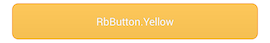

#  RichButtons
[](https://travis-ci.org/ksoichiro/RichButtons)
[](https://github.com/ksoichiro/RichButtons/releases/latest)

RichButtonsは、Androidアプリケーションで使うボタンのスタイルのセットです。全てXMLで作っています。


インストール
===

### Eclipse

* libraryフォルダがライブラリ本体です。EclipseなどのIDEでAndroid Library Projectとして取り込んでください。
* もしくは、ライブラリ内のファイルをあなたのプロジェクトへそのままコピーしてください。

### Gradle

```groovy
dependencies {
    compile 'com.github.ksoichiro:richbuttons:0.1.1@aar'
}

使い方
===

ボタンの背景、文字色等のスタイルは`<style>`として定義されています。以下のように、`RbButton.`で始まるスタイルをボタンに適用してください。

```xml
    <Button
        style="@style/RbButton.Blue"
        android:text="RbButton.Blue" />
```

スタイルをカスタマイズしたい場合は、ライブラリ内のスタイルの定義を変更するか、定義済みのスタイルをカスタマイズしたスタイルを作成してください。

## Blue

  
  

```xml
    <Button
        style="@style/RbButton.Blue"
        android:text="RbButton.Blue" />
```

## Purple

  
  

```xml
    <Button
        style="@style/RbButton.Purple"
        android:text="RbButton.Purple" />
```

## Green

  
  

```xml
    <Button
        style="@style/RbButton.Green"
        android:text="RbButton.Green" />
```

## Yellow

  
  

```xml
    <Button
        style="@style/RbButton.Yellow"
        android:text="RbButton.Yellow" />
```

## Red

  
  

```xml
    <Button
        style="@style/RbButton.Red"
        android:text="RbButton.Red" />
```

## Glossy

  
  

```xml
    <Button
        style="@style/RbButton.Glossy"
        android:text="RbButton.Glossy" />
```

## Inverse

  
  

```xml
    <Button
        style="@style/RbButton.Inverse"
        android:text="RbButton.Inverse" />
```

## Inverse.Red

  
  

```xml
    <Button
        style="@style/RbButton.Inverse.Red"
        android:text="RbButton.Inverse.Red" />
```

## Inverse.Blue

  
  

```xml
    <Button
        style="@style/RbButton.Inverse.Blue"
        android:text="RbButton.Inverse.Blue" />
```

## Inverse.LightBlue

  
  

```xml
    <Button
        style="@style/RbButton.Inverse.LightBlue"
        android:text="RbButton.Inverse.LightBlue" />
```

## Inverse.Green

  
  

```xml
    <Button
        style="@style/RbButton.Inverse.Green"
        android:text="RbButton.Inverse.Green" />
```

## Inverse.Orange

  
  

```xml
    <Button
        style="@style/RbButton.Inverse.Orange"
        android:text="RbButton.Inverse.Orange" />
```

## Inverse.Gray

  
  

```xml
    <Button
        style="@style/RbButton.Inverse.Gray"
        android:text="RbButton.Inverse.Gray" />
```

## Inverse.Black

  
  

```xml
    <Button
        style="@style/RbButton.Inverse.Black"
        android:text="RbButton.Inverse.Black" />
```

## Inverse.Rounded

  
  

```xml
    <Button
        style="@style/RbButton.Inverse.Rounded"
        android:text="RbButton.Inverse.Rounded" />
```

## Inverse.Rounded.Red

  
  

```xml
    <Button
        style="@style/RbButton.Inverse.Rounded.Red"
        android:text="RbButton.Inverse.Rounded.Red" />
```

## Inverse.Rounded.Blue

  
  

```xml
    <Button
        style="@style/RbButton.Inverse.Rounded.Blue"
        android:text="RbButton.Inverse.Rounded.Blue" />
```

## Inverse.Rounded.LightBlue

  
  

```xml
    <Button
        style="@style/RbButton.Inverse.Rounded.LightBlue"
        android:text="RbButton.Inverse.Rounded.LightBlue" />
```

## Inverse.Rounded.Green

  
  

```xml
    <Button
        style="@style/RbButton.Inverse.Rounded.Green"
        android:text="RbButton.Inverse.Rounded.Green" />
```

## Inverse.Rounded.Orange

  
  

```xml
    <Button
        style="@style/RbButton.Inverse.Rounded.Orange"
        android:text="RbButton.Inverse.Rounded.Orange" />
```

## Inverse.Rounded.Gray

  
  

```xml
    <Button
        style="@style/RbButton.Inverse.Rounded.Gray"
        android:text="RbButton.Inverse.Rounded.Gray" />
```

## Inverse.Rounded.Black

  
  

```xml
    <Button
        style="@style/RbButton.Inverse.Rounded.Black"
        android:text="RbButton.Inverse.Rounded.Black" />
```

## Darken

  
  

```xml
    <Button
        style="@style/RbButton.Darken"
        android:text="RbButton.Darken" />
```

## Recessed

  
  

```xml
    <Button
        style="@style/RbButton.Recessed"
        android:text="RbButton.Recessed" />
```

## ICS

  
  

```xml
    <Button
        style="@style/RbButton.ICS"
        android:text="RbButton.ICS" />
```

## ICS.Black

  
  

```xml
    <Button
        style="@style/RbButton.ICS.Black"
        android:text="RbButton.ICS.Black" />
```

## Plastic

  
  

```xml
    <Button
        style="@style/RbButton.Plastic"
        android:text="RbButton.Plastic" />
```

## Plastic.Rounded

  
  

```xml
    <Button
        style="@style/RbButton.Plastic.Rounded"
        android:text="RbButton.Plastic.Rounded" />
```


サンプル
===

* ライブラリを使用したサンプルアプリケーションは、samplesフォルダに含まれています。


開発者
===

* Soichiro Kashima - <soichiro.kashima@gmail.com>


ライセンス
===

    Copyright (c) 2013 Soichiro Kashima.

    Permission is hereby granted, free of charge, to any person obtaining a copy
    of this software and associated documentation files (the "Software"), to deal
    in the Software without restriction, including without limitation the rights
    to use, copy, modify, merge, publish, distribute, sublicense, and/or sell
    copies of the Software, and to permit persons to whom the Software is
    furnished to do so, subject to the following conditions:

    The above copyright notice and this permission notice shall be included in
    all copies or substantial portions of the Software.

    THE SOFTWARE IS PROVIDED "AS IS", WITHOUT WARRANTY OF ANY KIND, EXPRESS OR
    IMPLIED, INCLUDING BUT NOT LIMITED TO THE WARRANTIES OF MERCHANTABILITY,
    FITNESS FOR A PARTICULAR PURPOSE AND NONINFRINGEMENT. IN NO EVENT SHALL THE
    AUTHORS OR COPYRIGHT HOLDERS BE LIABLE FOR ANY CLAIM, DAMAGES OR OTHER
    LIABILITY, WHETHER IN AN ACTION OF CONTRACT, TORT OR OTHERWISE, ARISING FROM,
    OUT OF OR IN CONNECTION WITH THE SOFTWARE OR THE USE OR OTHER DEALINGS IN
    THE SOFTWARE.
